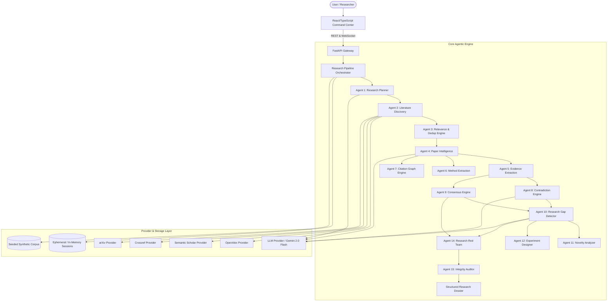

# NEXUS System Architecture

## 1. Architectural Overview

NEXUS is designed as an autonomous, evidence-grounded AI Research Scientist for Academic Literature Synthesis and Experiment Formulation. Rather than acting as a superficial paper summarizer, NEXUS models scholarly knowledge as structured entities (Papers, Claims, Evidence, Methods, Contradictions, Consensus, Gaps, Novelty Hypotheses, Experiment Proposals, and Audits).

---

## 2. Component Layers

### 2.1 Provider Abstraction Layer (`backend/app/providers/`)
- **LLMProvider**:
  - `GeminiProvider`: Direct integration with Google GenAI SDK (`google-genai`), structured output schema enforcement via Pydantic JSON schemas, multi-tier retry with exponential backoff, SHA-256 request caching (`LLMCache`), and sliding-window rate-limiting (`RateLimiter`).
  - `DemoLLMProvider`: Deterministic fallbacks for zero-key local demo environments.
- **AcademicSearchProvider**:
  - `OpenAlexProvider`: Free open scholarly graph with polite-pool indexing and inverted-index abstract reconstruction.
  - `SemanticScholarProvider`: High-impact graph indexing citation counts and open-access PDF discovery.
  - `CrossrefProvider`: DOI resolution and publisher metadata normalization.
  - `ArxivProvider`: Pre-print Atom XML feed parsing with category filtering.

### 2.2 Data & Research Knowledge Models (`backend/app/models/research.py`)
- **Paper**: Unique ID, title, authors, year, venue, DOI, abstract, citation count, open access status, composite research score (`relevance + recency + citation_influence + completeness`).
- **Claim & Evidence**: Atomic scientific statements linked to specific papers, experimental conditions, metrics, quantitative evidence values, and confidence ratings (`HIGH`, `MEDIUM`, `LOW`, `UNCERTAIN`).
- **MethodPipeline**: Multi-stage research pipelines (Dataset, Preprocessing, Feature Engineering, Model Architecture, Loss, Optimizer, Baselines, Evaluation Protocol).
- **Contradiction**: Categorized into `agreement`, `apparent_contradiction`, `contextual_disagreement`, `methodological_conflict`, `direct_contradiction`, or `unresolved` with shared vs. differing condition breakdown.
- **ConsensusFinding**: Categorized into `consensus`, `contested`, or `uncertain` with linked supporting and dissenting paper references.
- **ResearchGap & MissingExperiment**: Evidence-backed gaps and Cartesian evaluation holes (e.g. Model X not tested on Dataset Y).
- **NoveltyAssessment**: Explainable novelty breakdown (closest papers, explored dimensions, potentially unexplored dimensions, caveats).
- **ExperimentProposal**: Hypothesis, objectives, variables, baselines, proposed architecture, evaluation protocol, ablation studies, statistical validation tests, and failure criteria.
- **RedTeamResult & AuditResult**: Counter-arguments, potential bias checks, unsupported claim validation, and bibliography integrity verification.

### 2.3 Backend API & Real-Time Event System (`backend/app/api/`)
- REST endpoints for asynchronous session management, granular retrieval of literature, claims, contradictions, consensus, gaps, novelty, experiments, audit, and dossiers.
- WebSocket streaming channel (`/api/ws/research/{session_id}`) delivering live `AgentEvent` traces with progress metrics to the frontend execution monitor.

### 2.4 Frontend Research Command Center (`frontend/src/`)
- Built with React, TypeScript, and a scientific dark design system.
- 12 comprehensive analytical workspaces:
  1. **Research Overview**: Metric cards, decomposed subquestions, search queries, concept taxonomy.
  2. **Literature**: Ranked papers with expandable deep inspection (research problem, findings, limitations, claims).
  3. **Evidence Matrix**: Interactive tabular claim-to-evidence breakdown with filterable conditions.
  4. **Methods**: Pipeline comparisons across architectures, datasets, optimizers, and baselines.
  5. **Contradiction Engine**: Side-by-side claim comparison with shared/differing condition diffs and scientific explanations.
  6. **Consensus Board**: 3-column breakdown (Consensus vs. Contested vs. Uncertain).
  7. **Research Gaps & Missing Experiments**: Evidence-grounded opportunity analysis.
  8. **Novelty Analyzer**: Interactive hypothesis evaluator with semantic overlap diagnostics.
  9. **Experiment Designer**: Complete structured research protocol generator with exportable design.
  10. **Citation Graph**: Interactive SVG network visualizing citation topologies (`cites`, `extends`, `compares`, `challenges`, `supports`).
  11. **Research Dossier**: Formatted executive report with inline citation traceability.
  12. **Audit & Red Team**: Integrity verification counters, claim support audit, and adversarial challenge panel.

---

## 3. Storage & Persistence
- Local file-based caching for LLM requests (`data/cache/llm_cache/`).
- Ephemeral / In-Memory Sessions repository readiness.
- Zero external vector database cost — uses Deterministic relevance ranking with keyword-semantic cross-scoring.
